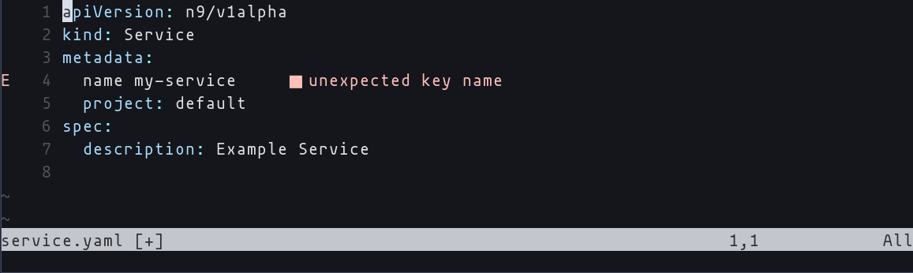
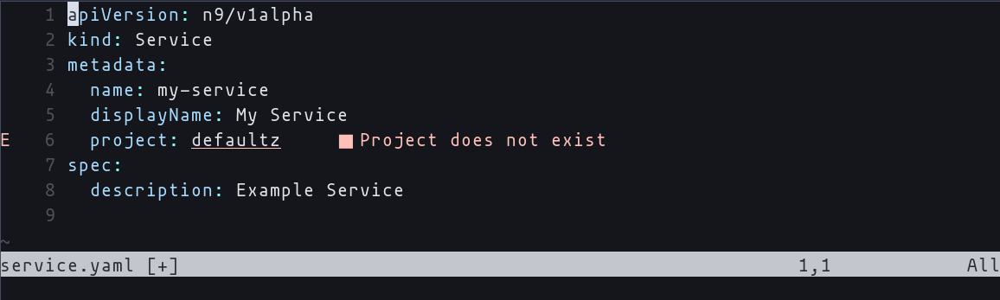
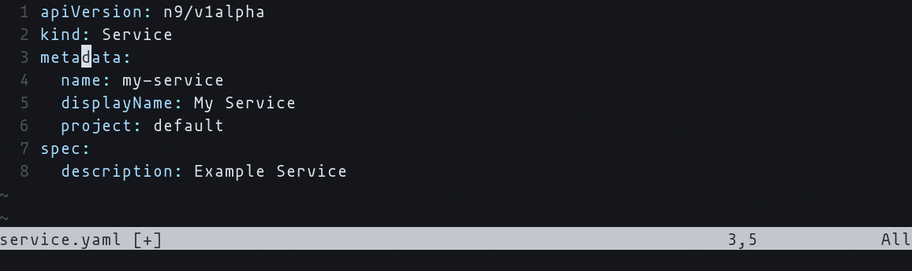

<!-- markdownlint-disable line-length html -->
<h1 align="center">
   <picture>
      <source media="(prefers-color-scheme: dark)" srcset="https://github.com/nobl9/nobl9-go/assets/48822818/caa6dfd0-e4b7-4cc5-b565-b867e23988ec">
      <source media="(prefers-color-scheme: light)" srcset="https://github.com/nobl9/nobl9-go/assets/48822818/4b0288bf-28ec-4435-af42-1d8918c81a47">
      
   </picture>
</h1>

Language server which implements [LSP protocol](https://microsoft.github.io/language-server-protocol/)
for Nobl9 configuration files.

LSP stands for Language Server Protocol.
It defines the protocol used between an editor or an IDE and a language server
(this project) that provides language features like auto complete,
diagnose file, display documentation etc.

## Installation

The Language Server binary has to be installed in your PATH,
so that the IDE can access it by calling `nobl9-language-server`
executable.
If installed outside the PATH, the location must be supplied to
the IDE through a dedicated option.
Refer to [specific IDE and plugin/extension](#integrations)
documentation for more details.

### Script

The script requires bash and a minimal set of GNU utilities.
On Windows it will work with either MinGW or Cygwin.
You can either pipe it directly into bash or download the file and run it manually.

```bash
# Using curl:
curl -fsSL https://raw.githubusercontent.com/nobl9/nobl9-language-server/main/install.bash | bash

# On systems where curl is not available:
wget -O - -q https://raw.githubusercontent.com/nobl9/nobl9-language-server/main/install.bash | bash

# If you prefer to first download the script, inspect it and then run it:
curl -fsSL -o install.bash https://raw.githubusercontent.com/nobl9/nobl9-language-server/main/install.bash
# Or with wget:
wget -O install.bash -q https://raw.githubusercontent.com/nobl9/nobl9-language-server/main/install.bash
# Once downloaded, set execution permissions:
chmod 700 install.bash
# The script is well documented and comes with additional options.
# You can display the help message by running:
./install.bash --help
```

### Prebuilt Binaries

The binaries are available at
[Releases](https://github.com/nobl9/nobl9-language-server/releases/latest) page.

### Go install

```bash
go install github.com/nobl9/nobl9-language-server/cmd/nobl9-language-server@latest
```

## Integrations

### Visual Studio Code

Refer to the [extension documentation](https://github.com/nobl9/nobl9-vscode/) for more details.

### Intellij Platform

Refer to the [plugin documentation](https://github.com/nobl9/nobl9-intellij-platform-plugin) for more details.

### Neovim

Minimal Neovim setup which assumes you've already configured
snippets support and LSP would look like this:

```lua
local lsp = require("lspconfig")
local configs = require("lspconfig.configs")

configs.nobl9_language_server = {
  default_config = {
    cmd = { "nobl9-language-server" },
    filetypes = { "yaml" },
    root_dir = function(fname)
      return vim.fs.dirname(vim.fs.find(".git", { path = fname, upward = true })[1])
    end,
    settings = {},
  },
}
```

Full, working configuration can be found [here](./docs/neovim-config/init.lua).
You can play with it and adjust to your needs.

```bash
nvim --clean -u ./docs/neovim-config/init.lua service.yaml
```

## Features

Currently only YAML format is supported. \
Server supports the following LSP features:

- [x] Auto completion
  - [x] YAML key names
    
  - [x] Enum values
    
  - [x] Nobl9 platform resource names
    
- [x] Diagnostics
  - [x] YAML syntax errors
    
  - [x] Static validation of the Nobl9 configuration
    
  - [x] Dynamic Nobl9 resource references validation
    
- [x] Hover documentation
  - [x] Property documentation
    
  - [x] Nobl9 resource documentation
    
- [x] Code Actions
  
- [x] Snippets
  

## How it works

The language server is integrated with several development environments
through dedicated plugins and extensions.
However, in theory, every IDE which supports LSP should work
with Nobl9 Language Server.

The server communicates over standard input/output streams (stdio) using
[JSON-RPC 2.0](https://www.jsonrpc.org/specification) protocol.
Typically, an IDE (which in LSP nomenclature is called a _client_) would run
the server, write requests to servers' standard input stream and read the
responses from servers' standard output stream.\
The following diagram demonstrates how an example communication flow
between client (IDE) and server looks like:


## Configuration

The Language Server comes with several configuration options.
Each option can be supplied via a dedicated flag when starting the server.

```bash
# Display help information.
nobl9-language-server -h

# Log level, by default 'INFO'.
# One of: TRACE, DEBUG, INFO, WARN, ERROR.
# Env: NOBL9_LANGUAGE_SERVER_LOG_LEVEL
nobl9-language-server --logLevel=TRACE

# Path to the server's log file.
# By default the logs are written into stderr.
# Env: NOBL9_LANGUAGE_SERVER_LOG_FILE_PATH
nobl9-language-server --logFilePath=/path/to/my-log-file.txt

# Configure file patterns, comma separated list of patterns.
# Remember to quote them if they include glob patterns!
# If this option is provided, the server will only work with the files matching these patterns.
# Env: NOBL9_LANGUAGE_SERVER_FILE_PATTERNS
nobl9-language-server --filePatterns='foo,bar/*,baz/**/*.yml'

# Display version information.
nobl9-language-server version
```

### YAML

> [!IMPORTANT]
By default, the language server will only offer its capabilities for files
which contain the following text: `apiVersion: n9/`.

If you're working on an empty file, the server won't work
until you write this text.
Likewise, If your file had this text, but you removed it
(maybe you cleared the whole file), the server will no longer work.

Internally, the server keeps track of **every** YAML file,
even if it is skipped. In the current version of LSP, there's no way to tell
the client we're skipping a file.
If you experience overhead when working with many YAML files other than
Nobl9 configuration, consider fine tuning your IDE to only send certain files
to the server.

How can I force the server to work on a file which does not include this text?

- Add `# nobl9-language-server: activate` comment **to the top of your file**.
- Configure file patterns with `--filePatterns` flag
  (see [configuration](#configuration)).

### Nobl9 API

In order for the server to work correctly,
it requires valid Nobl9 API access keys.
Under the hood the server uses [nobl9-go](https://github.com/nobl9/nobl9-go)
which is an official Golang SDK for Nobl9 platform.
The SDK provides ways of authenticating with the Nobl9 platform,
see [this document](https://github.com/nobl9/nobl9-go?tab=readme-ov-file#reading-configuration)
for more information on different ways the API access keys can be provided.

If you're a sloctl user and you already have the `config.toml` file,
the server will reuse it.

If you don't yet have any access keys, you can create them by following
the [official documentation](https://docs.nobl9.com/getting-started/access-keys).

If you're opting to configure the server using environment variables,
use the following prefix: `NOBL9_LANGUAGE_SERVER_` with any of the
environment variables supported by the SDK.

Example:

```bash
export NOBL9_LANGUAGE_SERVER_CLIENT_ID=<your-client-id>
export NOBL9_LANGUAGE_SERVER_CLIENT_SECRET=<your-client-secret>
```

## Development

Refer to the [development documentation](./docs/DEVELOPMENT.md) for more details.
